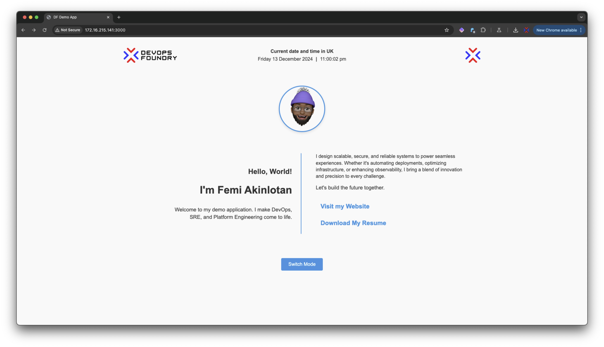
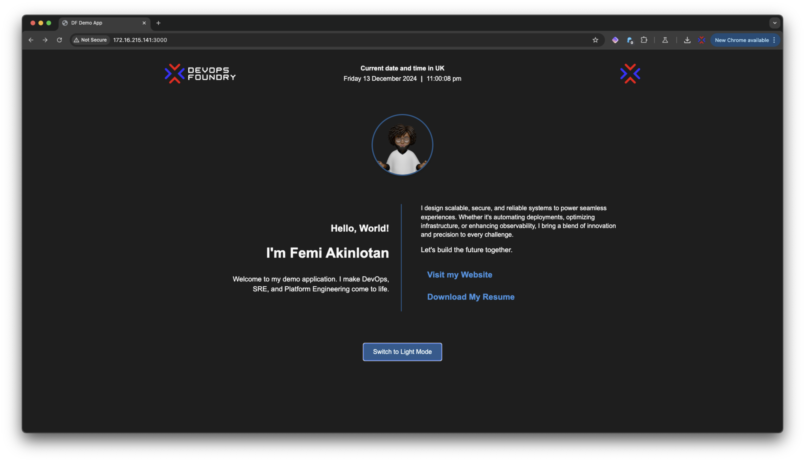

# DF DEMO APP

This is a minimal web application designed to showcase DevOps, SRE, and platform engineering tools and workflows. The application supports **light and dark mode** with distinct logos and banners for each mode. It is containerized using Docker and can be extended for CI/CD and GitOps workflows.

## Features
- **Light and Dark Mode**: Toggle between light and dark modes with different logos and banners for each.
- **Responsive Design**: A clean and modern single-page layout with basic HTML, CSS, and JavaScript.
- **Containerized**: Packaged with Docker for easy deployment and portability.
- **Scalable Architecture**: Built with Node.js and Express, suitable for future enhancements and integrations.


## Getting Started

### Prerequisites
- **Node.js** (version 16 or higher recommended)
- **npm** (comes with Node.js)
- **Docker** (for containerized deployment)

---

### Running Locally

1. **Clone the Repository**:
   ```bash
   git clone <repository-url>
   cd my-demo-platform
   ```

2. **Install Dependencies**:
   ```bash
   npm install
   ```

3. **Start the Application**:
   ```bash
   npm start
   ```
   The application will be accessible at [http://localhost:3000](http://localhost:3000).

---

### Running with Docker

1. **Build the Docker Image**:
   ```bash
   docker build -t my-demo-platform:latest .
   ```

2. **Run the Docker Container**:
   ```bash
   docker run -d -p 3000:3000 my-demo-platform:latest
   ```

3. **Access the Application**:
   Open [http://localhost:3000](http://localhost:3000) in your browser.


## Application Images



---

## Future Enhancements
- **CI/CD Integration**: Automate build and deployment pipelines using GitHub Actions or Jenkins.
- **GitOps**: Deploy the app to a Kubernetes cluster using ArgoCD or Flux.
- **Dynamic Content**: Add support for fetching and displaying dynamic data.
- **Monitoring and Observability**: Implement monitoring and observability tools.
- **Secrets Management**: Implement secrets management tools.


